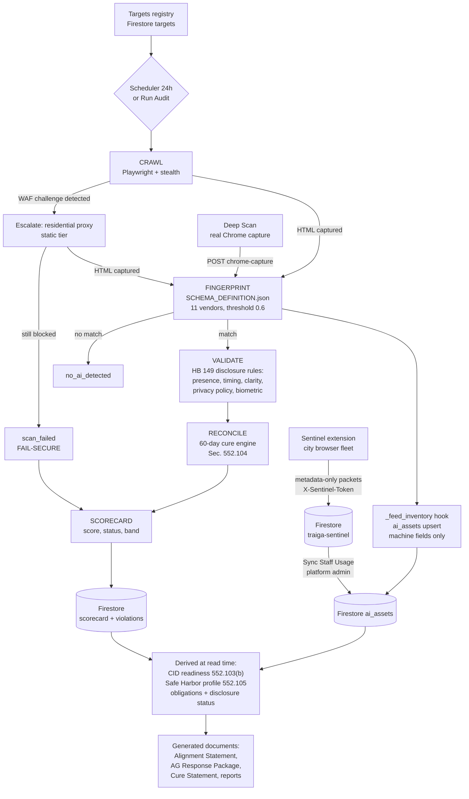

# System Architecture

Last updated 2026-07-18.

## 1. Component overview

| Layer | Technology | Deployment |
|---|---|---|
| Frontend | Vue 3 + Vuetify 3 + Pinia + Vue Router, built by Vite. Responsive: permanent nav ≥960px, overlay + app bar below; tables stack <600px | Firebase Hosting via GitHub Actions `deploy_frontend.yml` on push (`npm ci` → `vite build` → deploy). `deploy/deploy_frontend.bat` is a MANUAL FALLBACK only — it builds the working tree and reintroduces drift |
| Backend API | FastAPI (Python) + Uvicorn | Google Cloud Run, service `ai-transparency-auditor-api`, us-central1; deploys via GitHub Actions on push to `main` (backend only) |
| Scan engine | Playwright (pinned 1.44.0 to match the Docker base image) + playwright-stealth + requests/BeautifulSoup static fallback | Runs inside the Cloud Run container |
| Storage | Firestore, two named databases: `(default)` = governance, `traiga-sentinel` = Sentinel telemetry | GCP project `traiga-auditor` |
| Legacy storage | Google Sheets (rollback path: `GOVERNANCE_STORE`/`SENTINEL_STORE=sheets`) | Google Sheets API |
| Auth | Firebase Authentication (Google sign-in) → Firebase ID tokens verified by firebase-admin | — |
| Sentinel client | Browser extension (Manifest V3), separate codebase in `webextension/` | MDM-enforced install on city devices |

Cloud Run flags that must stay: `--allow-unauthenticated` (auth is app-level),
`--no-cpu-throttling`, `--session-affinity`.

## 2. Engine pipeline (flowchart)



ASCII fallback (same flow):

```
targets -> [crawl] --WAF?--> [proxy] --blocked--> scan_failed (fail-secure)
              |                  |
              +---- rendered HTML ----> [fingerprint 0.6] --none--> no_ai_detected
                                             |match
                                        [validate HB149] -> [reconcile 60d cure] -> [scorecard]
                                             |
                                        [_feed_inventory] -> ai_assets
Sentinel fleet -> ingest (token) -> traiga-sentinel DB -> sync -> ai_assets
ai_assets + violations + scans -> read-time derivation -> Safe Harbor / CID / documents
```

## 3. Data model (Firestore `(default)` governance DB)

| Collection | Contents | Key |
|---|---|---|
| `targets` | Cities to scan: city, jurisdiction, domain, url, tags, cloudflare_protected, active | short uuid |
| `scorecard` | One row per city: traiga_status, compliance_score, band, ai_assets_json, min_days_remaining, last_scanned_utc | city |
| `violations` | Rule findings with severity, citation, cure_deadline_utc, status (open/in_cure/cured/expired) | hash(city, asset, rule) |
| `ai_assets` | The registry: provenance (discovered_scan / discovered_sentinel / declared), machine evidence fields, human fields (owner, purpose, cid_*), lifecycle | asset_key |
| `safe_harbor` | Municipal AI Profile attestations: control_id, status, attested_by/utc, notes | city\|control_id |
| `audit_log` | Every consequential action with actor + summary | append-only |
| `users`, `agencies` | RBAC principals; agencies own city grants | email / agency id |

**Sheets contract:** all values stored as strings (legacy compatibility with
the Google Sheets backend); parse defensively everywhere.
**Sentinel DB** (`traiga-sentinel`): `events` (metadata-only violation
packets: city, site_id, policy_id, action, device, timestamps) and
`heartbeats` (device health).

## 4. Governance-as-code: SCHEMA_DEFINITION.json

One schema file carries every governance decision as data:

| Block | Carries |
|---|---|
| `AI_Vendor_Fingerprints` | 11 weighted vendor signatures (threshold 0.6) |
| `AI_Tool_Catalog` | 12 canonical tools + cross-channel aliases + 27 AI keywords (incl. a curated public-safety cluster) |
| `Compliance_Ruleset` | HB 149 external-transparency rules with statutory citations |
| `Safe_Harbor_Module` | Municipal AI Profile (14 controls) + framework crosswalk (NIST AI RMF, TRAIGA, ISO/IEC 42001) |
| `Site_Metadata_Signatures` | 7 agenda-platform + 7 CMS fingerprints and the privacy-link pattern, for site-metadata auto-capture |
| `Governance_Profile` | function → statutory-exposure map (cites real rule_ids only) + the sourced vendor-attribute vocabulary. **No risk score** is defined or computed |
| `violation_template` / `scorecard_schema` | Output shapes |

Adding a vendor, a rule, an AI keyword, an agenda platform, a framework crosswalk,
or (future) another state's statute is a schema change plus tests — not engine
surgery. Tests enforce the invariants (e.g. `Governance_Profile.statutory_exposure`
may only cite rule_ids that exist in `Compliance_Ruleset`).

## 5. Security & trust model

- **Two auth domains, never mixed:** dashboard reads use Firebase ID tokens
  (per-request SDK token with auto-refresh + one-shot 401 retry); Sentinel
  ingest uses shared device tokens (`X-Sentinel-Token`, constant-time compare,
  503 when unconfigured — fail-secure).
- **Sentinel read scoping:** Sentinel DLP reads are agency-scoped — the
  platform admin sees all; an agency admin/viewer sees only their granted
  cities' events/devices; untagged rows are platform-admin-only (fail-secure).
- **Metadata-only DLP:** ingest validates against a strict schema
  (`extra='forbid'`); packets containing prompt text are rejected loudly.
- **Fail-secure scanning:** WAF/challenge/error → `scan_failed`, surfaced in
  purple on the map; never silently clean. No score is shown for
  unassessed/failed cities.
- **CORS** locked to configured origins; rate limiting via slowapi.
- Known gap (roadmap H3): Sentinel and scanner currently share one service
  account; the split makes "Sentinel identity cannot read scanner data"
  fully true.

## 6. Environments & configuration (names only — no secrets in docs or repo)

| Env var | Purpose |
|---|---|
| `GOVERNANCE_STORE` / `SENTINEL_STORE` | `firestore` (prod) or `sheets` (rollback) |
| `FIRESTORE_PROJECT_ID` / `FIRESTORE_GOVERNANCE_DB` / `FIRESTORE_SENTINEL_DB` | Firestore wiring |
| `GOOGLE_SERVICE_ACCOUNT_FILE` | GCP service-account credential path |
| `SPREADSHEET_ID` | Legacy Sheets store |
| `ADMIN_EMAILS` | platform_admin bootstrap list |
| `REQUIRE_AUTH` | `true` in production; `false` unlocks local dev |
| `CORS_ORIGINS` | Allowed dashboard origins |
| `SCAN_PROXY_URL` / `SCAN_PROXY_ONLY_FLAGGED` | Residential proxy (ScraperAPI-style) routing |
| `RENDER_TIMEOUT_SECONDS` | Proxy RENDER-tier timeout (server-side JS; ~75s, far longer than a static fetch) |
| `SCAN_SCHEDULE_ENABLED` / `SCAN_SCHEDULE_HOUR` / `SCHEDULER_TOKEN` | Daily automated scan + Cloud Scheduler trigger auth |
| `AUDIT_LEASE_STALE_SECONDS` | Durable audit-run lease before a dead holder's slot may be stolen |
| `AGENDA_ENGINE_ENABLED` | Flag-gates the council-agenda discovery engine (off by default) |
| `AGENDA_LLM_PROVIDER` / `AGENDA_LLM_MODEL` / `AGENDA_LLM_LOCATION` | Agenda extractor swap point (`vertex` Gemini / `keyword` / `none`) |
| `AGENDA_FETCH_CONCURRENCY` / `AGENDA_LLM_CONCURRENCY` | Bounded parallelism that keeps a 12-month agenda backfill inside Cloud Run's 300s request timeout |
| `AGENDA_LOOKBACK_MONTHS` / `AGENDA_LOOKBACK_MONTHS_MAX` | Agenda backfill window + hard cap (cost control) |
| `FRAMEWORK_ISO_42001_ENABLED` | Turns on the ISO/IEC 42001 crosswalk lens |
| `SENTINEL_INGEST_TOKENS` | Comma-separated device ingest tokens |
| `API_HOST` / `API_PORT` | Local serving |

Secrets live in Cloud Run environment configuration (`deploy/env.yaml` is the
template) and are never committed.

## 7. Build, test, deploy

- **Backend:** push to `main` → GitHub Actions builds the Docker image
  (Playwright base `mcr.microsoft.com/playwright/python:v1.44.0-jammy`) and
  deploys Cloud Run. NOTE: deploy.yml has no test step yet (roadmap H1-6);
  tests run locally/standalone.
- **Frontend:** ships ONLY via `deploy\deploy_frontend.bat` (vite build +
  firebase deploy). Hard-refresh after deploy (Firebase serves cached JS).
- **Tests:** 64 standalone tests green as of 2026-07-07. In environments
  without PyPI, run with `PYTHONPATH=backend/tests/shims` (committed shims for
  fastapi/pydantic/slowapi). The Vite build is the JS gate.
- **Release discipline:** see OPERATIONS.md — blob-verification guard against
  NTFS truncation is mandatory before every push.
